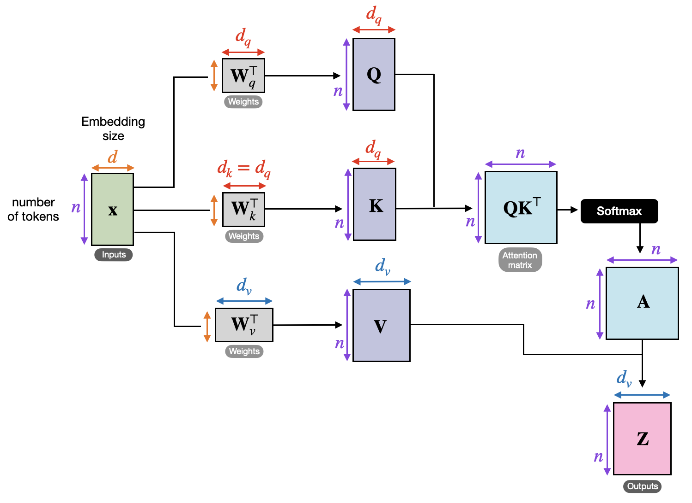
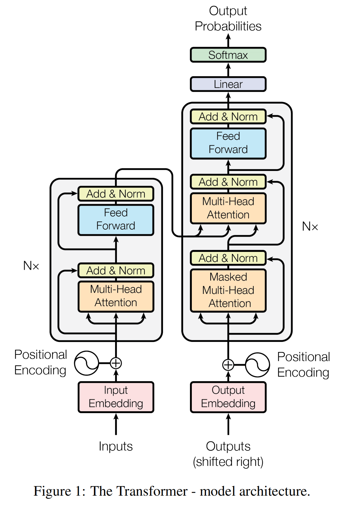

# Transformer 底层技术原理全拆解
Transformer是2017年Google在《Attention Is All You Need》中提出的序列建模架构，完全基于注意力机制实现，彻底抛弃了RNN系列的串行结构，解决了长序列建模的**梯度消失、并行计算效率低**两大核心痛点，是当前所有大语言模型、多模态模型的基础架构。

本文从**核心动机→基础单元→完整架构→训练推理→核心优势**，逐层拆解Transformer的底层原理。

---

## 一、Transformer解决的核心痛点
在Transformer之前，序列建模的主流方案是RNN/LSTM/GRU，存在两个致命缺陷：
1. **串行计算，无法并行**：每个时刻的输出必须依赖上一个时刻的结果，无法利用GPU的并行计算能力，训练效率极低，长序列场景尤为明显。
2. **长距离依赖捕捉能力弱**：序列信息需要一步步传递，长序列中前面的信息会被逐步稀释，同时伴随梯度消失问题，很难学到跨很远位置的依赖关系（比如长文本的指代关系）。

CNN虽然可以并行，但感受野有限，要捕捉长距离依赖需要堆叠大量卷积层，效率和效果都不理想。

Transformer的核心突破：**用自注意力机制，一步实现序列中任意两个token的信息交互，同时支持全序列并行计算**，完美解决了上述两个问题。

---

## 二、核心基础：缩放点积注意力（Scaled Dot-Product Attention）
自注意力是Transformer的最小核心单元，它的本质是：**给序列中的每个token，计算它和全序列所有token（包括自身）的关联权重，用权重对所有token的特征加权求和，得到融合了全序列上下文的新特征**。

### 2.1 核心概念：Q、K、V向量
每个输入token的嵌入向量（Embedding），会通过3个可学习的权重矩阵，生成3个不同的向量：
- **Query（ $Q$，查询向量）**：当前token的「搜索关键词」，用来匹配其他token的相关性。
- **Key（ $K$，键向量）**：其他token的「匹配标签」，用来和$Q$计算相似度。
- **Value（ $V$，值向量）**：token的「核心内容」，最终用来加权求和的特征。

> 类比理解：你在搜索引擎里搜「Transformer原理」（$Q$），引擎会匹配所有网页的标题（$K$），得到每个网页的匹配度，再按匹配度加权，把网页的内容（$V$）整合起来给你，就是自注意力的计算逻辑。

### 2.2 完整计算步骤（公式+通俗解释）
标准的缩放点积注意力公式：

$$Attention(Q,K,V) = Softmax\left( \frac{QK^T}{\sqrt{d_k}} \right) V $$

分4步拆解：
1. **计算相似度分数**：用 $Q$和 $K$的点积，计算当前token和每个token的匹配度，点积结果越大，相关性越高。
2. **缩放（Scaled）**：把点积结果除以 $\sqrt{d_k}$（$d_k$是$K$向量的维度）。
   - 底层原因：若$Q$、$K$的每个元素都是均值0、方差1的随机变量，点积结果的方差为$d_k$，维度越大，点积值的波动越大，会导致Softmax后输出接近one-hot分布，梯度几乎为0，无法训练。缩放后把方差拉回1，稳定梯度。
3. **掩码（Mask，可选）**：把不需要关注的位置的分数设为负无穷，Softmax后权重会变成0。
   - 常见掩码：因果掩码（Decoder用，遮挡未来的token，防止生成时提前看到后面的内容）、Padding掩码（遮挡输入的填充位，不让模型关注无效的Padding）。
4. **Softmax+加权求和**：Softmax把分数转为0-1之间、和为1的权重，再乘以$V$，加权求和得到当前token的最终注意力输出。

---

## 三、进阶核心：多头注意力（Multi-Head Attention, MHA）
单头注意力只能捕捉一种类型的依赖关系，而多头注意力是对单头注意力的扩展，也是Transformer的核心设计之一。

### 3.1 核心逻辑
把$Q$、$K$、$V$通过不同的线性投影，映射到$h$个不同的特征子空间，每个子空间独立做一次单头注意力计算，得到$h$个独立的注意力输出，再把所有头的结果拼接起来，经过一次线性投影，得到最终的多头注意力输出。

公式：
$$
MultiHead(Q,K,V) = Concat(head_1, head_2, ..., head_h) W_o
$$
$$
其中\ head_i = Attention(Q W_{q_i}, K W_{k_i}, V W_{v_i})
$$

### 3.2 设计意义
- **多语义捕捉**：不同的头可以学习不同类型的依赖关系，比如有的头关注相邻的语法关系，有的头关注长距离的指代关系，有的头关注核心语义的匹配，大幅提升模型的特征表达能力。
- **计算量可控**：原文中$d_{model}=512$，头数$h=8$，每个头的维度$d_k=d_v=512/8=64$，总计算量和单头注意力基本一致，没有额外的开销。

---

## 四、Transformer完整架构
Transformer是标准的Encoder-Decoder（编码器-解码器）架构，左侧为编码器，右侧为解码器，原文中编码器和解码器各堆叠6个完全相同的层。

  

  

### 4.1 前置处理：位置编码（Positional Encoding）
Transformer没有RNN的串行结构，天然没有序列的位置信息，没有位置编码的话，模型会把输入当成词袋，序列顺序变化输出不变，因此必须手动给每个token注入位置信息。

原文使用正弦余弦位置编码，公式：
$$
PE_{(pos, 2i)} = sin\left( \frac{pos}{10000^{2i/d_{model}}} \right)
$$
$$
PE_{(pos, 2i+1)} = cos\left( \frac{pos}{10000^{2i/d_{model}}} \right)
$$
- $pos$：token在序列中的位置，$i$是特征维度的索引。
- 设计优势：每个位置的编码唯一；可以学习到token之间的相对位置关系；可以泛化到训练时没见过的更长序列。

最终输入编码器的特征 = token的嵌入向量 + 对应位置的位置编码。

---

### 4.2 编码器（Encoder）
编码器的作用是对输入序列进行编码，提取全序列的上下文语义特征，输出给解码器使用。

每个编码器层包含2个核心子层，所有子层都带**残差连接+层归一化**，结构为：$LayerNorm(x + Sublayer(x))$
1. **多头自注意力层**：$Q$、$K$、$V$都来自上一层的输出，是序列自身和自身的注意力，捕捉输入序列内部的双向依赖关系（每个token都能看到全序列的所有token）。
2. **前馈神经网络（FFN）**：对每个token的特征独立做非线性变换，公式为：
$$
FFN(x) = max(0, xW_1 + b_1)W_2 + b_2
$$
> 注意力是线性的加权求和，FFN提供非线性变换，大幅提升模型的表达能力。

#### 残差连接+层归一化的作用
- 残差连接：解决深层网络的梯度消失问题，让几十上百层的Transformer可以稳定训练。
- 层归一化（LayerNorm）：对每个样本的特征做归一化（均值0、方差1），不依赖batch大小，适配NLP的变长序列，稳定训练过程，加速收敛。

---

### 4.3 解码器（Decoder）
解码器的作用是基于编码器的输出，自回归地生成目标序列。

每个解码器层包含3个核心子层，同样都带残差连接+层归一化：
1. **掩码多头自注意力层**：加入因果掩码，只允许当前token看到它之前的token，遮挡未来的token，符合文本生成从左到右的逻辑，防止信息泄露。
2. **交叉注意力（Encoder-Decoder Attention）**：$Q$来自解码器上一层的输出，$K$和$V$来自编码器的最终输出，让解码器在生成每个token时，能关注到输入序列的相关部分（比如翻译时，生成英文单词对应到中文原词）。
3. **前馈神经网络（FFN）**：和编码器中的FFN完全一致。

---

### 4.4 输出层
解码器的最终输出，经过线性层把特征维度映射为词表大小，再经过Softmax得到每个token的概率分布，取概率最大的token作为当前步的输出，再把这个输出作为下一步的输入，继续生成，直到遇到结束符。

---

## 五、Transformer的训练与推理逻辑
### 5.1 训练阶段（全并行）
训练时可以输入完整的目标序列，通过掩码遮挡未来的token，一次性计算所有位置的预测结果和交叉熵损失，完全并行计算，没有串行依赖，训练效率远高于RNN系列。

### 5.2 推理阶段（自回归串行）
推理时是串行的，生成第$t$个token时，只能使用前$t-1$个已经生成的token作为输入，一步步自回归生成，直到输出结束符。

---

## 六、Transformer的主流变体
原生的Encoder-Decoder架构多用于机器翻译、摘要等条件生成任务，当前主流大模型都基于Transformer的简化变体：
1. **Encoder-only架构（双向Transformer）**：代表是BERT，只有编码器，使用双向自注意力，适合文本理解类任务（分类、NER、阅读理解、语义匹配）。
2. **Decoder-only架构（单向Transformer）**：代表是GPT系列、LLaMA系列，只有解码器，使用带掩码的单向自注意力，适合文本生成、对话等自回归生成任务，也是当前通用大语言模型的主流架构。
3. **Encoder-Decoder架构**：代表是T5、BART，保留完整的编解码结构，适合机器翻译、文本摘要、图文生成等条件生成任务。

---

## 七、Transformer的核心优势
1. **极致的长距离依赖捕捉能力**：任意两个token只需一次注意力计算就能完成信息交互，不管序列多长，长距离依赖的建模难度不会增加，彻底解决了RNN的长序列痛点。
2. **完美的并行计算能力**：训练阶段全序列并行，充分利用GPU的并行算力，支持大规模数据和大参数量模型的训练。
3. **强大的特征表达能力**：多头注意力可以同时捕捉多种类型的语义、语法、依赖关系，配合非线性FFN和深层结构，特征拟合能力极强。
4. **优秀的泛化能力**：Transformer的架构通用性极强，不仅适配NLP的所有任务，还可以扩展到语音、图像、视频等多模态领域，成为AI领域的通用基础架构。